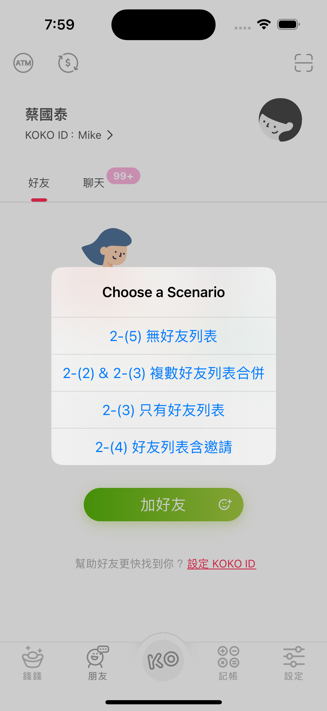

# Swift UIKit MVVM App - Friend List Management

This project implements a friend list management interface using **Swift**, **UIKit**, following the **MVVM** design pattern. 
It supports three different states of the user interface and handles asynchronous API requests to simulate various friend list scenarios.

    

## Features

### 1. Three UI States

    

- **1-(1) No Friends**: Displays when there are no friends in the list.

- **1-(2) Friend List**: Shows when there are friends. (**Note: The API still returns one invitation**).

- **1-(3) Friends with Invitations**: Displays when there are friends and the API returns two invitations.

### 2. API Integration and Simulation

The app makes asynchronous API requests to simulate the following scenarios:

1. **No Friends**: Requests data from the API at `https://dimanyen.github.io/friend4.json` (No data returned for friends or invitations).

    

   
2. **Friend List**: Makes two API requests to:
    - `https://dimanyen.github.io/friend1.json`
    - `https://dimanyen.github.io/friend2.json`
   
    The results are combined into a list, and if any `fid` data is duplicated between the two, the app uses the record with the most recent `updateDate`.

    

3. **Friends with Invitations**: Makes a request to `https://dimanyen.github.io/friend3.json` to simulate a scenario where both friends and invitations are present.

    
    

### 3. Search Bar Functionality

- The search bar allows users to search through friends' names.

## Bonus Features

The following additional functionalities are included to enhance the user experience:

1. **MJRefresh - Pull-to-Refresh**:
    - The friend list uses **MJRefresh** to support pull-to-refresh functionality. This allows users to refresh the list by pulling it down, which triggers the API to fetch updated data again.
   
2. **Search Bar Push**: When the search bar is tapped, it is pushed to the top under the `UINavigationBar` for better accessibility.

    

3. **Collapsible Invitations**: The invitations section in the friend list supports a collapse and expand action for a cleaner interface.

4. **Unit Testing**: Unit tests are included to verify the behavior of API requests and ensure proper data handling.

## API Data Sources

Here are the data sources used in the app:

- **User Data**: `https://dimanyen.github.io/man.json`
- **Friend List 1**: `https://dimanyen.github.io/friend1.json`
- **Friend List 2**: `https://dimanyen.github.io/friend2.json`
- **Friend List with Invitations**: `https://dimanyen.github.io/friend3.json`
- **No Data (Friends/Invitations)**: `https://dimanyen.github.io/friend4.json`

---

### Instructions to Run the Project

1. Clone the repository and open the project in Xcode.
2. Build the project using a target device or simulator with iOS 17.2 or later.
3. Test the various UI states by selecting the scenarios on the startup screen.
4. Pull down the list and trigger a refresh of the data.

### Requirements

- Xcode 15.2+
- iOS 17.2+
- **MJRefresh** (Installed via CocoaPods)

### Additional Notes

- Make sure to have an active internet connection while running the app, as it fetches data from remote APIs.
